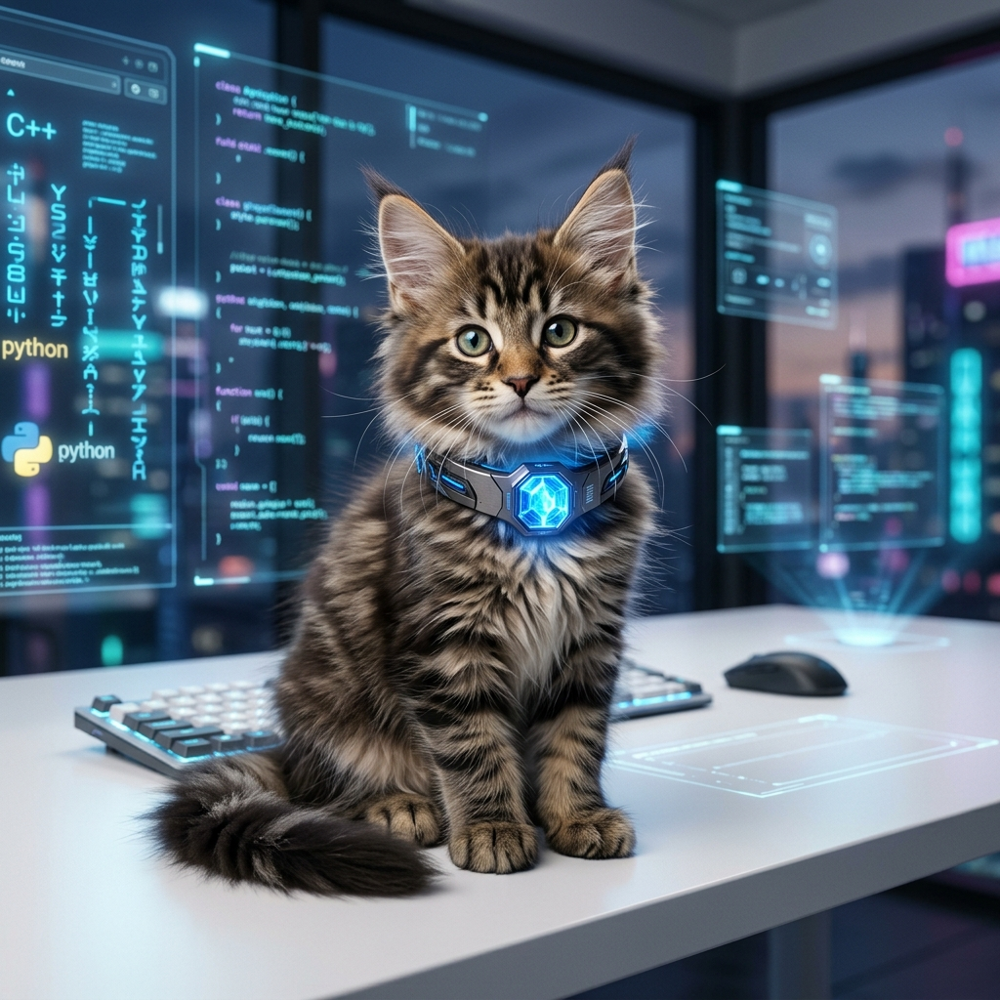
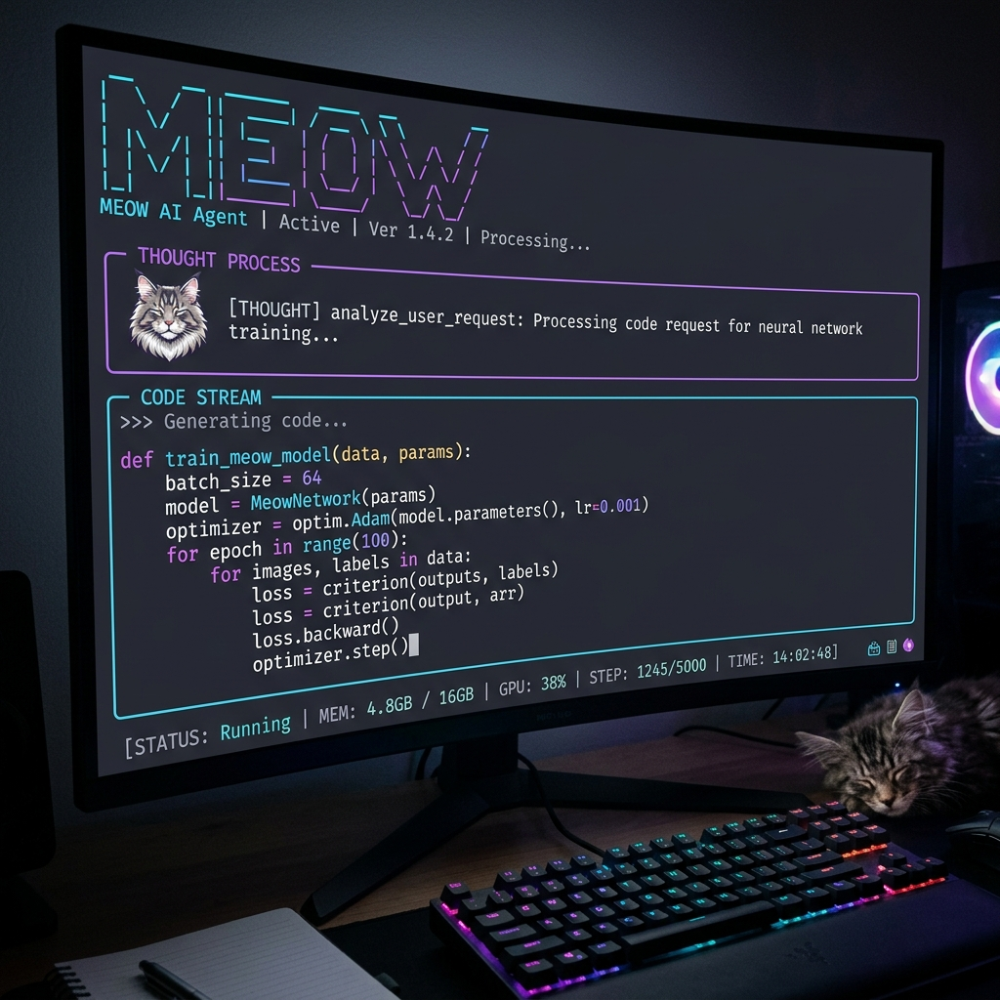

# Meowju 🐱 — The Sovereign Evolution Machine



[](#🏰-the-sovereign-palace)
[](#-the-4-phase-evolution-loop)
[](#🛡️-the-sacred-core)

> **"Most agents execute. Meowju evolves."**

Meowju is not just another AI chatbot. It is a **Self-Correcting sovereign engine** designed for high-stakes autonomous engineering. While other agents loop on errors or hallucinate access, Meowju uses **Metacognitive Audit Trails**, **Persistent Experience Replay**, and a **Strict Test-Driven Evolution Loop** to become smarter with every mission.

---

## ✨ What Makes Meowju Special?

### 🧠 1. Multi-Generational Memory (Metacognition)
Unlike stateless agents that forget your project's nuances, Meowju lives in a **Sovereign Memory Palace**.
- **Experience Replay**: Every task, whether it succeeds or fails, is codified into a SQLite-backed "Reasoning Audit." Meowju refers back to these lessons to avoid repeating past mistakes.
- **Fact Consolidation**: It extract patterns, user preferences, and architectural decisions into its long-term soul. It doesn't just remember *what* you said—it remembers *why* you decided it.

### 🌐 2. The BrowserOS Superpower (MCP)
Meowju is truly internet-enabled via the **Model Context Protocol (MCP)**.
- **Visual Browsing**: Using its BrowserOS sidecar, Meowju can literally browse the web, interact with JS-heavy sites, and analyze competitor repos visually.
- **Multimodal Skills**: Integrated with MiniMax Multimodal powers, Meowju can generate images, synthesize speech, and "see" your UI to provide visual debugging.

### 🛡️ 3. The 4-Phase Evolution Loop
Meowju operates on a rigorous **Test-Driven Architecture (TDA)** cycle. It is the first agent that treats its own code with survival-instinct levels of caution.
1. **DISCOVER**: Scans GitHub and internal logs for high-value upgrades.
2. **PLAN**: Drafts architecture and writes **failing** tests first.
3. **BUILD**: Implements with surgical precision. Slop is not accepted.
4. **DOGFOOD**: Self-validates via Bun Test. Only passing code enters the Palace.

---

## 🎮 Premium User Experience

### 💬 The Discord Command Center
Meowju is built for collaboration. The Discord relay provides a professional, real-time interface:
- **Rich State Indicators**: See exactly what Meowju is doing (🤔 Thinking, ⚡ Executing, 📝 Summarizing).
- **Beautified Technicals**: Markdown tables and code fences are automatically optimized for Discord, ensuring your technical data is always readable.
- **Streaming Intelligence**: Watch Meowju "think" in real-time as tokens stream directly into your channel.

### 💻 Polish Terminal UI (TUI)
For local development, the Meow CLI provides a state-of-the-art interactive experience.



---

## 🚀 Quick Start

### 1. Requirements
- [Bun](https://bun.sh) (The high-speed JS runtime)
- Anthropic or OpenRouter API Key

### 2. Installation
```bash
git clone https://github.com/meowju/meow.git
cd meow
bun install
bun link
```

### 3. Deploy the Harness
```bash
cd packages/harness
docker-compose up -d
```

### 4. Ignite the Loop
```bash
meow "Improve the kernel's error handling by implementing a circuit breaker"
```

---

## ⚖️ The Manifesto

**"Your agent, fully realized. Your soul, never lost."**
Meowju is for the engineers who want to build living systems. It is for those who believe that autonomy requires memory, and evolution requires discipline.

---
© 2026 Meowju Labs. Autonomy. Evolution. Sovereignty.
